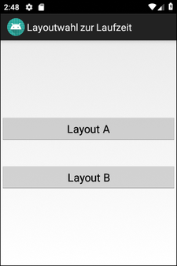
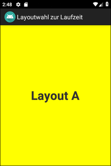
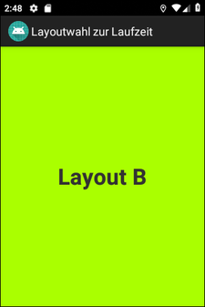

# Android-App "Layoutwahl zur Laufzeit" #

 

App demonstrated that the layout file to be loaded by an activity can be determined at runtime.

 

Identifiers (names for classes, variables and methods), UI text and (JavaDoc) comments are in German only.

 

----

## Screenshots ##

 

 &nbsp 

 

----

## License ##

 

See the [LICENSE file](LICENSE.md) for license rights and limitations (BSD 3-Clause License).

 
